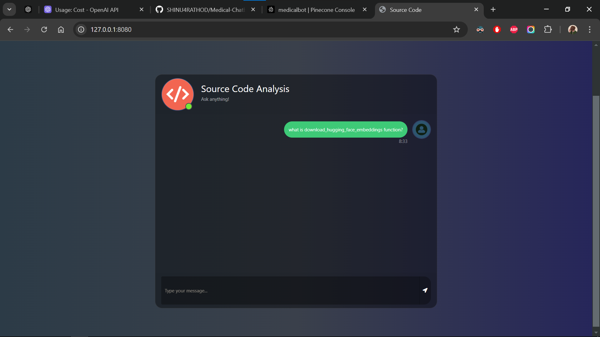

# End-to-end-Source-Code-Analysis-Generative-AI


Table of Contents
* Overview
* Tech Stack
* Technologies
* How It Works
* Data Sources
* Features
* Setup
* Usage
* License

## Project Overview
This project automates source code analysis by processing a GitHub repository link provided by the user. The system clones the repository, extracts all Python (.py) files, splits the code into meaningful chunks, and generates embeddings. These embeddings are stored in ChromaDB, enabling query-based retrieval. Using a Large Language Model (LLM), the system provides context-aware responses based on the project's source code.

## Tech Stack
LangChain: Framework for building applications powered by language models.
LLM (Large Language Models): Used for understanding and answering queries.
ChromaDB: Vector database for efficient embedding storage and retrieval.
- Python
- LangChain
- Flask
- OpenAI
- GPT 3
- ChoromaDB

#### Python Libraries:
 - git: For cloning repositories.
- langchain.text_splitter: For chunking code.
- langchain.document_loaders.generic: For loading documents.
- langchain.document_loaders.parsers: For parsing source code.
- langchain.embeddings.openai: For generating embeddings.
- langchain.vectorstores: For connecting to ChromaDB.
- langchain.chat_models: For chat-based models.
- langchain.memory: For managing conversational memory.

## How It Works Example Query Flow
Repository Upload: User provides a GitHub repository link.
Code Extraction: The repository is cloned, and Python files are extracted.
Code Chunking: Files are split into manageable code chunks using the RecursiveCharacterTextSplitter.
Embedding Generation: Code chunks are embedded using OpenAIEmbeddings.
Data Storage: Embeddings are stored in ChromaDB for efficient search and retrieval. with LangChain, LLM, and ChromaDB
Query & Response: Users submit queries, and the system retrieves relevant code chunks and generates responses using LLM-powered models.

#### Example Response
Query: "What does the download_hugging_face_embeddings function do?"

LLM Response:
"The download_hugging_face_embeddings function initializes and returns embeddings using the Hugging Face model sentence-transformers/all-MiniLM-L6-v2, which generates 384-dimensional embeddings. These embeddings are used to create vector representations of text data for further analysis."


## Data Sources
GitHub Repository: The project clones repositories from GitHub and processes their source code files.

## Features
Repository Cloning: Downloads the specified GitHub repository.
Code Extraction: Extracts Python files from the repository.
Chunking & Embedding: Splits files into chunks and generates embeddings.
Query-Based Retrieval: Retrieves code-related information based on user queries.
Natural Language Responses: Provides clean, concise explanations from LLM.


## Setup
### STEPS:

Clone the repository

```bash
Project repo: https://github.com/
```
### STEP 01- Create a conda environment after opening the repository

```bash
conda create -n SourceCodeAnalyser python=3.10 -y
```

```bash
conda activate SourceCodeAnalyser
```


### STEP 02- install the requirements
```bash
pip install -r requirements.txt
```

### Create a `.env` file in the root directory and add your OPENAI_API_KEY credentials as follows:

```ini
OPENAI_API_KEY = "xxxxxxxxxxxxxxxxxxxxxxxxxxxxx"
```


```bash
# Finally run the following command
python app.py
```

Now,
```bash
open up localhost:
```


# Usage
Upload GitHub Repository Link: Provide a repository link for analysis.
Query the System: Enter queries like "What does the function download_hugging_face_embeddings do?"
Receive Results: Get clear, concise responses from the LLM based on the project code.

# License
This project is licensed under the MIT License. See the LICENSE file for more details.


